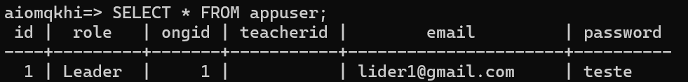
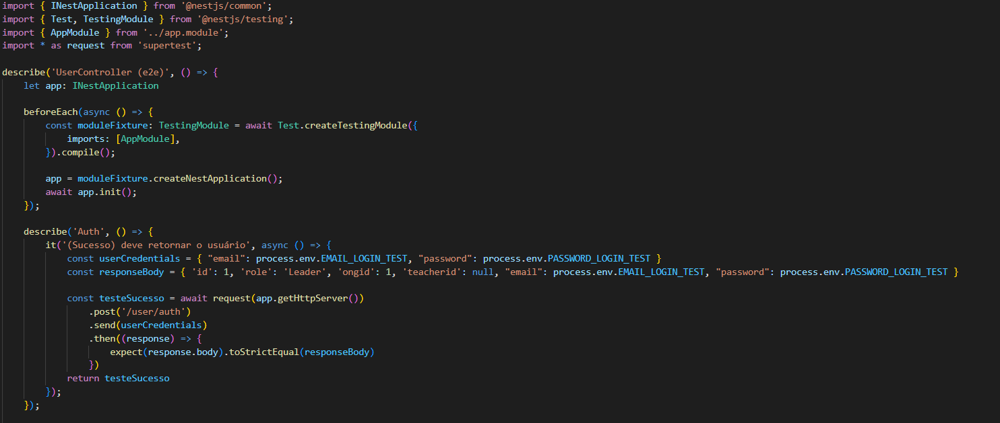
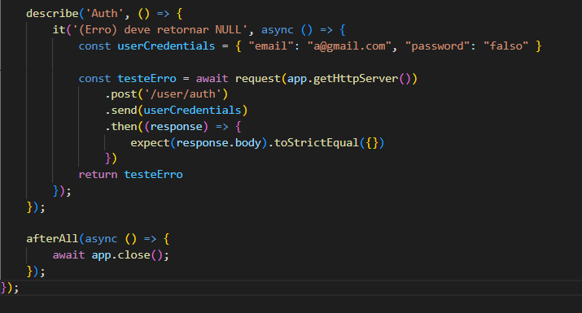
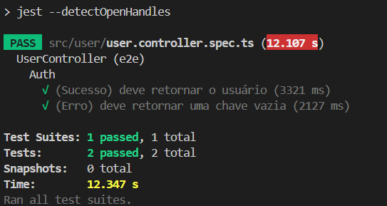

# Auto Estudo - Teste Automatizado

## Objetivo:
&emsp; O objetivo do teste é fazer a validação do login de usuários na plataforma, para isso foi usada o framework NestJS que possui métodos de teste dentro da sua API e também foi usado a biblioteca supertest para realizar comunicação HTTP com a aplicação.

## Pré-Condição:
&emsp; A pré-condição do teste é ter o resgitro no banco de dados na tabela appuser desse usuário. Além disso é preciso iniciar uma instância de teste do modulo da aplicação.
<div align="center">
  <p>Imagem 01 - Usuário no banco de dados</p>
  
  <p>Fonte: Autoria própria</p>
</div>

<div align="center">
  <p>Imagem 02 - Função "beforeEach" que inicia a instância de teste</p>
  
  <p>Fonte: Autoria própria</p>
</div>

## Procedimento de Teste:
&emsp; No teste, tanto de Sucesso como de Erro, é feito uma solicitação POST para a rota de autenticação de usuário, Passando as credenciais do usuário (email e senha), no caso de sucesso é passado o email: lider1@gmail.com e senha: teste, e no caso de erro é passado o email: a@gmail.com e senha: falso

<div align="center">
  <p>Imagem 03 - Teste de Sucesso</p>
  
  <p>Fonte: Autoria própria</p>
</div>

<div align="center">
  <p>Imagem 04 - Teste de Erro</p>
  
  <p>Fonte: Autoria própria</p>
</div>

## Resultado Esperado:
&emsp; Para o resultado esperado de sucesso se espera que o resultado seja uma chave com os atributos do usuário logado como mostrado no Banco de Dados. E para o resultado esperado de erro se espera que o resultado seja uma chave vazia, como mostrado nas imagens acima.

## Resultado Obtido:
&emsp; O resultado obtido foi de sucesso, visto que os dois testes passaram com êxito, como mostrado na imagem abaixo.

<div align="center">
  <p>Imagem 05 - Resultado dos Testes</p>
  
  <p>Fonte: Autoria própria</p>
</div>

## Pós-Condição:
&emsp; Após rodar os dois teste é chamado uma função "afterAll" que encerra a instância de teste do modulo da aplicação, como mostrado na imagem abaixo.

<div align="center">
  <p>Imagem 06 - Função "afterAll" que encerra a instância de teste</p>
  
  <p>Fonte: Autoria própria</p>
</div>

## Comando para rodar o teste
```javascript
npm run test
```


